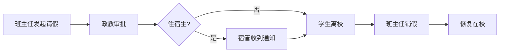

# SmartGrade 智慧年级管理平台

> 一个真正围绕学生状态管理设计的校园协同平台

## Vision

让班主任随时掌握学生状态。

通过数字化流程替代纸质流转，
通过实时协同替代重复沟通，
通过完整留痕提升管理质量。

SmartGrade 不只是一个请假系统，
而是一套围绕学生状态构建的智慧年级协同平台。

---

## 项目简介

SmartGrade 是一套专为高中年级管理打造的微信小程序协同办公平台。

系统围绕**学生状态管理**这一核心思想，整合通知发布、文件发放、学生请销假、宿舍管理、教师待办、数据统计等多个业务模块，实现年级管理工作的数字化、流程化、规范化。

本项目遵循 **"少输入、多选择；少沟通、多协同；全过程留痕、全过程可追溯"** 的设计理念，帮助学校降低管理成本，提高工作效率。

---

# 项目目标

SmartGrade 致力于解决高中年级管理中的以下问题：

- 请假流程繁琐
- 通知无法精准发送
- 文件下发缺少反馈
- 宿舍管理信息不互通
- 多角色教师办公效率低
- 学生状态无法实时掌握
- 历史记录查询困难
- 数据统计依赖人工整理

---

# 核心设计理念

整个系统遵循以下设计思想：

## 一切围绕学生状态

任何时刻，一个学生只能拥有一个当前状态。

例如：

- 🟢 在校
- 🟡 已批准待离校
- 🟠 已离校

所有模块共享同一份学生状态数据。

---

## 一切操作形成时间轴

系统中的任何重要操作均自动生成一条时间轴记录。

例如：

```
09:12 班主任 发起请假

09:15 政教 审批通过

09:18 宿管 收到通知

08:05 次日 班主任 销假
```

所有历史永久保存，不允许物理删除。

---

## 老师尽量不输入

系统尽可能采用：

- 点击选择
- 自动带出
- 自动关联
- 自动统计

减少教师重复录入。

---

## 多角色协同办公

一个教师账号允许拥有多个角色。

例如：

- 班主任
- 任课教师
- 年级主任
- 政教教师
- 宿舍管理员
- 党员教师

登录一次即可拥有全部权限。

---

# 用户角色

系统支持以下角色：

| 角色 | 说明 |
|------|------|
| 系统管理员 | 系统维护 |
| 年级主任 | 年级管理 |
| 政教教师 | 审批请假 |
| 班主任 | 学生管理 |
| 宿舍管理员 | 住宿管理 |
| 普通教师 | 通知接收 |

角色支持自由组合。

---

# 功能模块

## 教师端

- 工作台
- 待办中心
- 通知中心
- 文件中心
- 学生管理
- 请销假管理
- 宿舍管理
- 数据统计
- 我的

---

## 管理后台

- 数据驾驶舱
- 教师管理
- 学生管理
- 班级管理
- 宿舍管理
- 通知管理
- 文件管理
- 标签中心
- 权限管理
- 组织架构
- 数据统计
- 操作日志
- 系统设置

---

# 核心业务流程



---

# 系统设计原则

整个系统必须遵循以下原则：

1. 一个学生只有一个当前状态。
2. 所有操作必须形成时间轴。
3. 所有数据永久保存。
4. 所有审批进入待办。
5. 通知与待办完全分离。
6. 一个教师允许拥有多个角色。
7. 权限采用角色+组织+标签模型。
8. 老师尽量少输入。
9. 所有数据支持统计分析。
10. 所有操作必须可追溯。

---

# 技术架构（建议）

## 教师端

- 微信小程序
- Vue3
- TypeScript
- Pinia

---

## 后台管理

- Vue3
- Element Plus

---

## 服务端

- NestJS

---

## 数据库

- MySQL

---

## 缓存

- Redis

---

## 文件存储

- 腾讯云 COS

---

# 项目目录

```
SmartGrade/

├── README.md

├── docs/

├── frontend/

├── backend/

├── database/

├── assets/

└── prototype/
```

---

# 开发规范

本项目采用：

- Markdown 文档驱动开发（Documentation Driven Development）
- AI 协同开发（ChatGPT + Trae）
- 模块化开发
- 组件化开发
- Git 版本管理

---

# 开发阶段

第一阶段

- 项目架构
- 登录
- 权限
- 教师管理
- 学生管理

第二阶段

- 请销假
- 通知
- 文件
- 待办

第三阶段

- 宿舍管理
- 时间轴
- 数据统计

第四阶段

- AI辅助功能
- 导出功能
- 系统优化

---

# 文档说明

docs 目录包含所有开发文档：

| 文件 | 说明 |
|------|------|
| 01-PRD.md | 产品需求文档 |
| 02-BusinessFlow.md | 业务流程 |
| 03-Teacher.md | 教师端页面 |
| 04-Admin.md | 后台页面 |
| 05-Database.md | 数据库设计 |
| 06-API.md | 接口文档 |
| 07-Permission.md | 权限设计 |
| 08-UI.md | UI规范 |
| 09-AI_RULE.md | AI开发规范 |
| 10-PROJECT_RULE.md | 项目设计原则 |

---

# 当前版本

**Architecture Baseline v1.1**（Sprint 2.1 + C01 + C02 冻结）

当前状态：

> **稳定里程碑达成。** Sprint 2.1（架构基线）+ C01（Workbench）+ C02（Student Leave）已完成验证。
>
> 六层流水线正式成为固定开发模式：Controller → CapabilityService → DomainService → Repository → Timeline → Prisma
>
> 后续所有 Capability 沿用同一模式，不再新增架构层级。

---

# 作者

产品架构：

刘忠昊老师 × ChatGPT

开发：

Trae AI

---

# License

仅供本项目使用。
