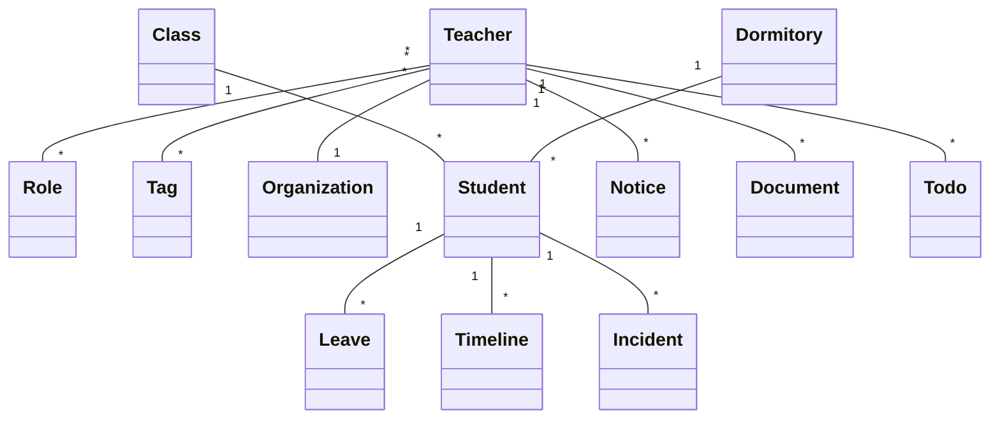

# SmartGrade 领域模型（Domain Model）

> Version：1.0.0
>
> Project：SmartGrade 智慧年级管理平台
>
> Status：Draft（草案）
>
> Priority：★★★★★

---

# 文档目的

本文件定义 SmartGrade 的核心业务对象（Domain）、对象之间的关系以及职责边界。

本文件不涉及数据库字段设计，仅描述业务模型。

数据库设计必须遵循本文件。

API设计必须遵循本文件。

页面设计必须遵循本文件。

---

# 一、系统核心思想

SmartGrade 的核心不是：

- 请假
- 通知
- 文件

而是：

> **Student（学生）**

整个系统所有业务都是围绕 Student 展开。

因此 Student 是整个系统的核心聚合（Aggregate Root）。

---

# 二、领域模型总览



---

# 三、核心领域对象

## 3.1 Student（学生）

### 定义

系统最核心对象。

所有业务最终都关联 Student。

---

### Student 负责

- 当前状态
- 班级
- 宿舍
- 时间轴
- 请假
- 异常

---

### Student 不负责

通知。

权限。

审批。

---

## Student 生命周期

```text
创建

↓

分班

↓

住宿

↓

正常在校

↓

请假

↓

返校

↓

毕业

↓

归档
```

---

# 3.2 Teacher（教师）

Teacher 表示：

所有教职工。

Teacher：

拥有多个角色。

拥有多个标签。

属于一个组织。

---

Teacher：

不能拥有学生。

Student 永远属于 Class。

---

# 3.3 Leave（请假）

Leave：

学生离校申请。

属于 Student。

生命周期：

```text
创建

↓

审批

↓

待离校

↓

已离校

↓

销假

↓

完成
```

Leave：

负责：

审批流程。

Student：

负责：

当前状态。

二者不能混淆。

---

# 3.4 Timeline（时间轴）

Timeline：

系统唯一历史来源。

任何业务：

最终都生成 Timeline。

例如：

请假。

审批。

异常。

通知。

Timeline：

不可修改。

不可删除。

只能新增。

---

# 3.5 Incident（异常）

Incident：

异常事件。

例如：

宿舍异常。

未请假离寝。

晚归。

纪律问题。

Incident：

必须关联 Student。

处理完成后：

仍然保留。

---

# 3.6 Dormitory（宿舍）

Dormitory：

宿舍信息。

包括：

宿舍楼。

房间。

床位。

Student：

引用 Dormitory。

不得复制宿舍数据。

---

# 3.7 Class（班级）

Class：

班级。

Student：

必须属于一个 Class。

Teacher：

可以管理多个 Class。

---

# 3.8 Notice（通知）

Notice：

信息发布。

特点：

无需处理。

支持：

角色。

组织。

标签。

精准发送。

---

# 3.9 Todo（待办）

Todo：

需要处理。

例如：

审批。

确认。

阅读。

Todo：

完成以后：

自动结束。

Notice：

不会结束。

---

# 3.10 Document（文件）

Document：

文件。

包括：

Word。

PDF。

Excel。

图片。

支持：

阅读。

下载。

确认。

---

# 3.11 Role（角色）

Role：

决定：

业务权限。

例如：

班主任。

政教。

宿管。

管理员。

一个 Teacher：

允许拥有多个 Role。

---

# 3.12 Tag（标签）

Tag：

辅助分类。

例如：

党员。

英语组。

青年教师。

Tag：

不决定权限。

仅用于：

消息。

筛选。

统计。

---

# 3.13 Organization（组织）

Organization：

学校组织。

例如：

学校

↓

高一年级

↓

11班

权限：

可按 Organization 控制。

---

# 四、聚合关系

## Student 聚合

Student

├── Leave

├── Timeline

├── Incident

└── Dormitory

Student：

负责整个学生生命周期。

---

## Teacher 聚合

Teacher

├── Role

├── Tag

└── Organization

Teacher：

负责登录。

权限。

消息。

---

# 五、对象之间关系

| 对象 | 关系 |
|------|------|
| Teacher → Student | 管理 |
| Teacher → Notice | 发布 |
| Teacher → Todo | 处理 |
| Student → Leave | 拥有 |
| Student → Timeline | 拥有 |
| Student → Incident | 拥有 |
| Student → Dormitory | 入住 |
| Class → Student | 包含 |
| Organization → Teacher | 包含 |

---

# 六、事件流（Event）

系统采用：

事件驱动。

例如：

StudentLeaveCreated

↓

LeaveApproved

↓

StudentLeftSchool

↓

LeaveClosed

↓

StudentReturned

每个事件：

自动生成 Timeline。

---

# 七、领域边界

## 学生域

Student

Leave

Timeline

Incident

Dormitory

Class

---

## 教师域

Teacher

Role

Tag

Organization

Permission

---

## 办公域

Notice

Todo

Document

Attachment

---

## 系统域

Login

OperationLog

Message

Config

---

# 八、设计原则

- Student 是系统核心对象。
- Leave 不保存学生状态。
- Timeline 是唯一历史来源。
- Todo 与 Notice 完全分离。
- Teacher 支持多角色。
- Tag 不决定权限。
- 所有业务围绕 Student 展开。
- 所有对象职责单一。

---

# 九、未来扩展

未来允许增加：

- Parent（家长）
- Guardian（监护人）
- Visitor（访客）
- HealthRecord（健康记录）
- CounselingRecord（心理辅导）
- Merit（奖励）
- Discipline（处分）

新增对象不得破坏现有领域关系。

---

# 修订记录

| Version | Date | Description |
|---------|----------|----------------|
| 1.0.0 | 2026-07-15 | 首次建立领域模型 |
