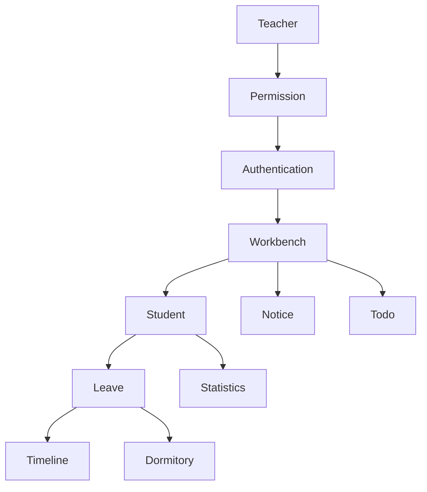

# SmartGrade 功能架构（Feature Architecture）

> Version：1.0.0
>
> Project：SmartGrade 智慧年级管理平台
>
> Status：Draft
>
> Priority：★★★★★

---

# 文档目的

本文档定义 SmartGrade 的完整功能架构。

所有页面、数据库、接口、权限均来源于本功能架构。

任何新增功能必须首先更新本文件。

---

# 产品树（Product Tree）

```text
SmartGrade
│
├── A. 登录认证（Authentication）
│
├── B. 教师工作台（Workbench）
│
├── C. 学生管理（Student）
│
├── D. 请销假管理（Leave）
│
├── E. 宿舍管理（Dormitory）
│
├── F. 通知中心（Notice）
│
├── G. 文件中心（Document）
│
├── H. 待办中心（Todo）
│
├── I. 时间轴（Timeline）
│
├── J. 数据统计（Statistics）
│
├── K. 教师管理（Teacher）
│
├── L. 组织权限（Permission）
│
└── M. 系统设置（System）
```

---

# 模块清单

| 编号 | 模块 | 优先级 | V1.0 |
|------|------|------|------|
| A | 登录认证 | P0 | ✅ |
| B | 教师工作台 | P0 | ✅ |
| C | 学生管理 | P0 | ✅ |
| D | 请销假管理 | P0 | ✅ |
| E | 宿舍管理 | P0 | ✅ |
| F | 通知中心 | P0 | ✅ |
| G | 文件中心 | P1 | ✅ |
| H | 待办中心 | P0 | ✅ |
| I | 时间轴 | P0 | ✅ |
| J | 数据统计 | P1 | ✅ |
| K | 教师管理 | P0 | ✅ |
| L | 组织权限 | P0 | ✅ |
| M | 系统设置 | P1 | ✅ |

---

# A 登录认证（Authentication）

## 子模块

- 登录
- 自动登录
- 微信授权
- Token 管理
- 退出登录

### 页面

- 登录页
- 权限加载页

负责人：

所有教师

---

# B 教师工作台（Workbench）

## 子模块

- 今日待办
- 今日请假
- 今日通知
- 快捷入口
- 今日统计
- 最近操作

### 页面

- 工作台首页
- 待办卡片
- 统计卡片

负责人：

全部教师

---

# C 学生管理（Student）

## 子模块

- 学生列表
- 学生详情
- 搜索学生
- 学生状态
- 班级学生

### 页面

- 学生列表
- 学生详情
- 学生时间轴

负责人：

班主任

年级主任

---

# D 请销假管理（Leave）

## 子模块

- 发起请假
- 审批
- 已批准待离校
- 已离校
- 销假
- 历史记录

### 页面

- 新建请假
- 审批中心
- 请假详情
- 历史记录

负责人：

班主任

政教

宿管

---

# E 宿舍管理（Dormitory）

## 子模块

- 查寝
- 今日住宿请假
- 异常上报
- 宿舍列表
- 宿舍详情

### 页面

- 查寝
- 今日住宿请假
- 异常详情

负责人：

宿舍管理员

---

# F 通知中心（Notice）

## 子模块

- 发布通知
- 阅读确认
- 分类通知
- 标签通知
- 通知历史

负责人：

年级主任

管理员

---

# G 文件中心（Document）

## 子模块

- 文件上传
- 文件下载
- 阅读确认
- 分类管理

负责人：

管理员

---

# H 待办中心（Todo）

## 子模块

- 我的待办
- 已完成
- 审批待办
- 文件确认

负责人：

所有教师

---

# I 时间轴（Timeline）

## 子模块

- 学生时间轴
- 操作记录
- 历史查询

负责人：

所有管理角色

---

# J 数据统计（Statistics）

## 子模块

- 今日请假统计
- 班级统计
- 宿舍统计
- 教师统计
- 通知统计

负责人：

年级主任

管理员

---

# K 教师管理（Teacher）

## 子模块

- 教师列表
- 教师角色
- 标签
- 任课信息

负责人：

管理员

---

# L 组织权限（Permission）

## 子模块

- 角色管理
- 标签管理
- 组织管理
- 权限管理

负责人：

管理员

---

# M 系统设置（System）

## 子模块

- 参数设置
- 字典配置
- 日志
- 数据备份

负责人：

管理员

---

# 模块依赖关系



---

# 开发优先级

## P0（必须完成）

- 登录
- 工作台
- 学生
- 请销假
- 宿舍
- 通知
- 待办
- 时间轴
- 权限

---

## P1（建议完成）

- 文件中心
- 数据统计
- 系统设置

---

## V2.0 预留模块

- AI助手
- 家校沟通
- 班级量化
- 巡查记录
- 值班管理
- 自动周报
- 自动数据分析

---

# 本文档说明

后续文档必须按照本产品树继续展开：

Teacher.md

↓

Admin.md

↓

Database.md

↓

API.md

不得增加未定义模块。

新增模块必须首先修改本文件。
