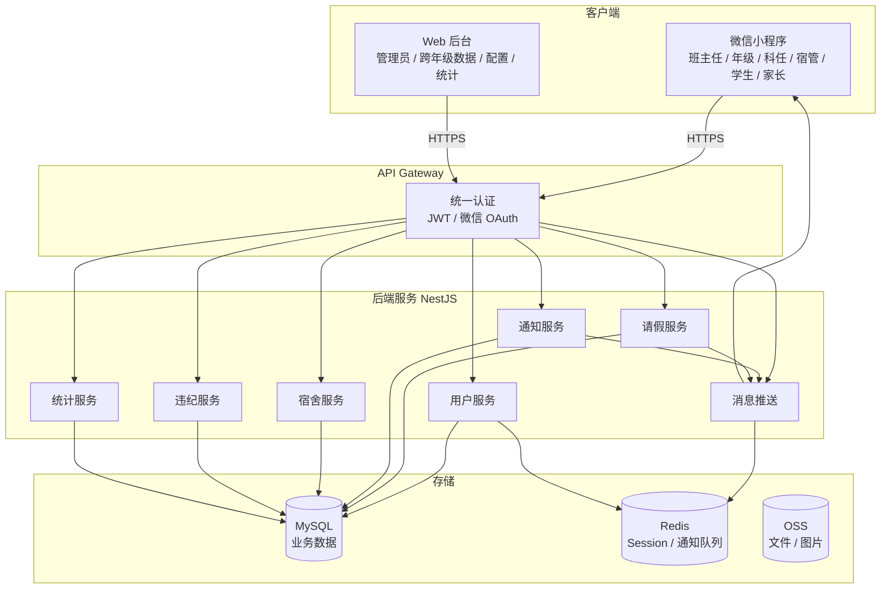
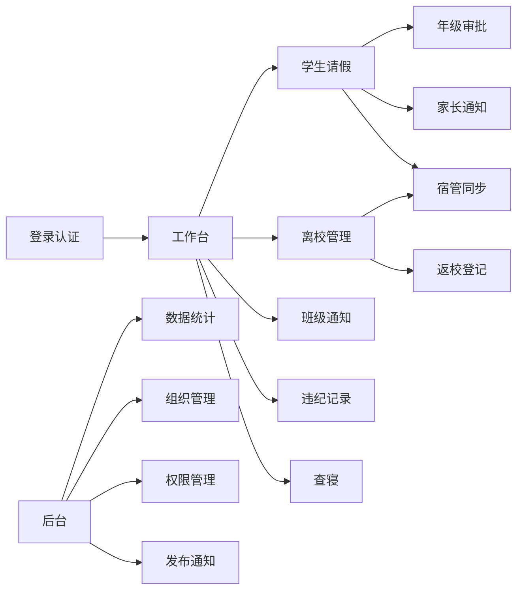
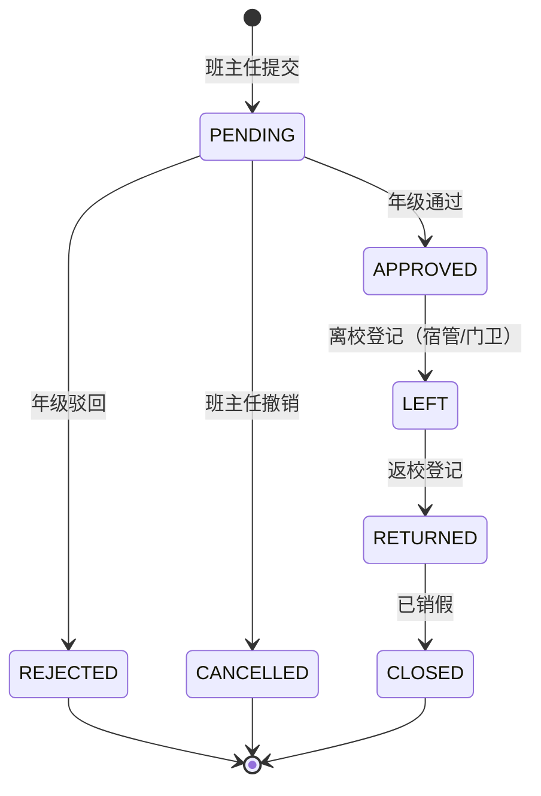
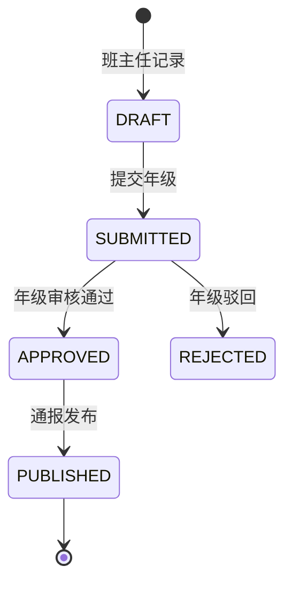
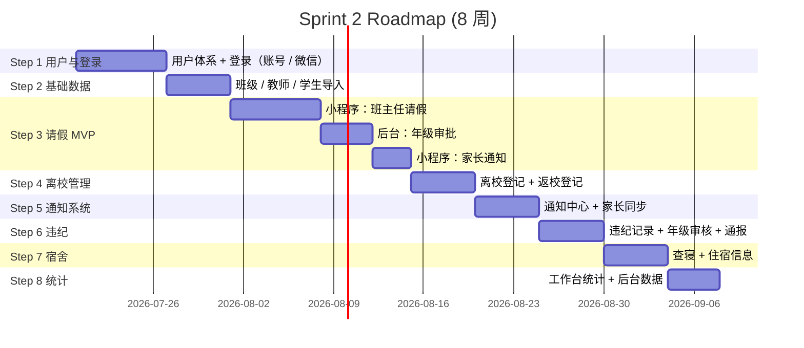

# Sprint 2 Planning — 产品定位校准与开发顺序

> Version：1.0.0
> Project：SmartGrade 智慧年级管理平台
> Status：Draft（待评审）
> Author：Trae（基于刘老师产品复盘）
> Date：2026-07-18

---

## 文档目的

本文档是 Sprint 1 收官后的**产品方向校准**与**Sprint 2 启动计划**。

核心目的：
1. 把产品定位从「学校 ERP / 后台优先」调整为「**小程序优先、后台辅助**的校园工作平台」
2. 校准 6 类核心角色的工作场景与权限边界
3. 把**班主任（最高频用户）**的「今日工作台」作为 MVP 主线
4. 给出 Sprint 2 的开发顺序：先小程序、再后台补充
5. 给出小程序与后台的页面规划骨架（不写代码）

> 关键原则：本规划**不修改 Project Rule（R-001 ~ R-028）**，仅在「前端形态 + 优先级」层面校准。
> 现有 02-DomainModel / 04-FeatureArchitecture / 08-Database / 09-API / 10-Permission 文档保持权威地位。

---

# 第一章 产品定位校准

## 1.1 旧定位 vs 新定位

| 维度 | Sprint 1 旧定位（后台优先） | Sprint 2 新定位（小程序优先） |
|---|---|---|
| 入口形态 | Web 后台为主 | **微信小程序为主** + Web 后台为辅 |
| 核心用户 | 系统管理员、年级主任 | **班主任**（最高频 ⭐⭐⭐⭐⭐） |
| 核心场景 | 数据管理、配置、统计 | 每日工作台：请假 / 离校 / 通知 / 违纪 |
| 家长角色 | 模糊、未定义 | **信息接收者**（不参与业务操作） |
| 节奏 | 后台逐步堆功能 | **班主任 3 步完成请假**（R-008 三次点击原则） |

## 1.2 核心用户群（按使用频次）

| # | 角色 | 频次 | 主要场景 | 入口 |
|---|---|---|---|---|
| ⭐⭐⭐⭐⭐ | 班主任 | 每天 | 今日工作台、请假登记、班级通知 | **小程序** |
| ⭐⭐⭐⭐ | 年级主任 | 每天 | 请假审批、违纪通报、离校统计 | 小程序 + 后台 |
| ⭐⭐⭐ | 科任教师 | 每天 1-2 次 | 课堂缺勤查看、异常反馈 | **小程序** |
| ⭐⭐⭐ | 宿管 | 每天 2 次 | 上下午查寝、住宿数据 | **小程序** |
| ⭐⭐ | 学生 | 不定期 | 查看通知、查看请假状态 | **小程序** |
| ⭐ | 家长 | 不定期 | **只接收**通知 | **小程序** |
| 后台 | 系统管理员 | 不定期 | 配置、统计、发布 | 后台 |

> 后台用户的真实使用场景 = 配置 + 统计 + 跨年级数据查询，不应承担日常高频操作。

## 1.3 家长定位——重点

**家长不是业务操作主体**，不允许发起请假、修改信息。

家长端只做：
- 接收学生状态变更通知（请假 / 离校 / 违纪 / 通知）
- 查看历史接收记录
- 设置接收偏好

❌ 禁止：家长申请请假
✅ 允许：家长接收通知

---

# 第二章 产品架构图

## 2.1 整体架构



## 2.2 业务能力地图



---

# 第三章 用户角色权限模型

## 3.1 角色（6 类，3 层）

| 层 | 角色 | 关键场景 | DataScope |
|---|---|---|---|
| 教师层 | 班主任 | 班级学生请假 / 离校 / 通知 | CLASS |
| 教师层 | 科任教师 | 课堂缺勤查看 | GRADE |
| 教师层 | 年级主任 | 请假审批 / 违纪审核 / 离校统计 | GRADE |
| 教师层 | 宿管 | 查寝 / 住宿 | DORM |
| 学生层 | 学生 | 查看通知 / 查看请假 | SELF |
| 家庭层 | 家长 | 接收通知 | CHILD |
| 平台层 | 超级管理员 | 配置 / 跨年级 / 统计 | ALL |

## 3.2 角色 × 业务 × 端矩阵

| 角色 | 请假发起 | 请假审批 | 离校登记 | 查寝 | 通知发布 | 通知接收 | 数据统计 |
|---|---|---|---|---|---|---|---|
| 班主任 | ✅ | ✖ | ✅ | ✖ | 班级级 | ✅ | 班级级 |
| 年级主任 | ✖ | ✅ | 查看 | ✖ | 年级级 | ✅ | 年级级 |
| 科任教师 | ✖ | ✖ | ✖ | ✖ | ✖ | ✅ | ✖ |
| 宿管 | ✖ | ✖ | 同步 | ✅ | ✖ | ✅ | 宿舍级 |
| 学生 | ✖ | ✖ | ✖ | ✖ | ✖ | ✅ | ✖ |
| 家长 | ✖ | ✖ | ✖ | ✖ | ✖ | ✅ | ✖ |
| 管理员 | 后台 | 后台 | 后台 | 后台 | 后台 | 后台 | ✅ |

> 「请假发起」由**班主任**统一负责（不是家长）。这是流程的强制约束。

## 3.3 班主任的「今日工作台」设计（重点）

```text
[今日工作台]  2026-07-18
━━━━━━━━━━━━━━━━━━━━━━━━━━

┌─ 今日概览 ─────────────────┐
│ 👥 班级人数  48人          │
│ 🏫 在校人数  46人          │
│ 🚪 今日离校  2人           │
│ 📝 待处理请假 3条          │
│ ⚠️ 今日违纪  1人           │
│ 📢 年级通知  2条           │
└─────────────────────────────┘

┌─ 待办列表 ─────────────────┐
│ 🔴 张三  请假待提交  [去处理]│
│ 🟡 李四  请假审批通过       │
│ 🟡 王五  返校登记           │
└─────────────────────────────┘

┌─ 快捷入口 ─────────────────┐
│ [+ 请假登记]  [+ 违纪记录] │
│ [+ 班级通知]  [📋 查寝]    │
└─────────────────────────────┘
```

**3 次点击原则**（R-008）保证：
工作台 → 请假登记 → 提交
工作台 → 班级通知 → 发布

## 3.4 年级主任的「审批中心」

```text
[审批中心]  2026-07-18
━━━━━━━━━━━━━━━━━━━━━━━━━━

待审批 12
──────────────
学生    班级    原因    时间    班主任
张三   高一1班  病假   1天    李老师
李四   高一2班  事假   3天    王老师
...

操作：
[通过]  [驳回]

──────────────
今日统计：
请假 18人
已离校 15人
未返校 3人
```

## 3.5 宿管的「查寝」

```text
[查寝]  2026-07-18 上午
━━━━━━━━━━━━━━━━━━━━━━━━━━
宿舍楼1号

301: 应到 6 / 实到 5 / 缺寝 1
  · 张三（已离校，自动过滤）
  · 李四  ⚠️ 未归 [登记]

302: 应到 6 / 实到 6 / 缺寝 0
  · 正常

[提交查寝记录]
```

> R-018：查寝自动过滤已批准离校学生。

---

# 第四章 数据模型设计

> 复用 02-DomainModel 与 08-Database。Sprint 2 在此基础上**新增/强化**以下模型。

## 4.1 核心模型（沿用 + 强化）

| 模型 | 调整 |
|---|---|
| Student | 增加 `current_status` 当前状态字段（已存在 IN_SCHOOL/PENDING_LEAVE/LEFT_SCHOOL） |
| Class | 增加 `head_teacher_id` 班主任外键 |
| Teacher | 调整支持多角色（一个教师可同时是班主任 + 科任） |
| LeaveRecord | **状态机细化**：PENDING → GRADE_APPROVED → LEFT → RETURNED → CLOSED |
| TimelineEvent | 所有事件来源（保留 R-013 / R-014） |
| DormRoom / Bed | 床位与学生强关联 |

## 4.2 新增/强化模型

| 模型 | 说明 |
|---|---|
| ParentStudentRelation | 家长-学生关联（多对多） |
| ParentNotifyPreference | 家长接收偏好（微信 / 短信 / 不接收） |
| IncidentReport | 违纪记录（含班主任记录 + 年级审核） |
| DormRollCall | 查寝记录（上午/晚间） |
| NoticeReceipt | 通知回执（含家长） |
| WechatAccount | 微信绑定（OAuth 用） |

## 4.3 请假状态机（强化版）



> **关键约束**：
> - `APPROVED → LEFT` 由宿管/门卫扫码或人工登记
> - `LEFT → RETURNED` 由班主任确认
> - 学生状态 = 上述状态机 + 时间轴（R-002 唯一状态）

## 4.4 违纪流程状态机



## 4.5 数据模型关系（核心）

```mermaid
erDiagram
    Grade ||--o{ Class : 包含
    Class ||--o{ Student : 拥有
    Class }o--|| Teacher : head_teacher
    Student ||--o{ LeaveRecord : 申请
    Student ||--o{ IncidentReport : 触发
    Student ||--o{ TimelineEvent : 拥有
    Student }o--o{ Parent : 关联
    Teacher ||--o{ Role : 拥有
    Teacher }o--o{ Organization : 所属
    DormBuilding ||--o{ DormRoom : 包含
    DormRoom ||--o{ Bed : 包含
    Student ||--o| Bed : 分配
    LeaveRecord ||--o{ TimelineEvent : 生成
    Notice ||--o{ NoticeReceipt : 触发
```

---

# 第五章 Sprint 2 开发顺序

> 拒绝"按后台模块顺序"开发。Sprint 2 严格按**班主任工作流**展开。

## 5.1 Sprint 2 路线图



## 5.2 8 个 Step 的详细说明

| Step | 模块 | 端 | 关键交付 |
|---|---|---|---|
| **Step 1** | 用户体系 + 登录 | 全端 | 7 角色账号体系、手机号/账号登录、微信 OAuth 接入位、Token 管理、家长账号绑定 |
| **Step 2** | 基础数据 | 后台 + 小程序 | 班级 / 教师 / 学生 / 家长导入，年级数据预置 |
| **Step 3** | **请假 MVP** ⭐ | 小程序优先 | 班主任 3 步发起请假、年级审批工作台、家长通知 |
| **Step 4** | 离校管理 | 小程序 | 离校登记、返校确认、自动同步家长 |
| **Step 5** | 通知系统 | 小程序 + 后台 | 年级发布通知、班级通知、家长同步、回执 |
| **Step 6** | 违纪 | 小程序 + 后台 | 班主任记录 → 年级审核 → 通报 → 家长接收 |
| **Step 7** | 宿舍 | 小程序 | 上午/晚间查寝、住宿信息、缺寝登记 |
| **Step 8** | 数据统计 | 小程序 + 后台 | 班主任工作台统计、年级 Dashboard、家长接收率 |

## 5.3 优先级总表

| P | Step | 备注 |
|---|---|---|
| **P0** | Step 1 用户体系 | 所有业务前置 |
| **P0** | Step 2 基础数据 | 所有业务前置 |
| **P0** | Step 3 请假 MVP | 核心场景，决定性场景 |
| **P0** | Step 4 离校管理 | 与请假绑定，**同一张状态机** |
| **P0** | Step 5 通知系统 | 家长触达的唯一通道 |
| **P1** | Step 6 违纪 | 班主任日常 |
| **P1** | Step 7 宿舍 | 宿管日常 |
| **P1** | Step 8 统计 | 后台侧 KPI |

---

# 第六章 小程序端页面规划

## 6.1 班主任（最高频用户 ⭐⭐⭐⭐⭐）

| # | 页面 | 入口 | 关键功能 |
|---|---|---|---|
| B-01 | **今日工作台** | 启动页 | 概览、待办、快捷入口 |
| B-02 | **请假登记** | 工作台/班级 | 3 步发起请假、学生选择、原因、证明图片 |
| B-03 | 班级请假列表 | 工作台 | 今日 / 本周 / 本月，状态筛选 |
| B-04 | 请假详情 | 列表 | 完整状态机、审批历史、时间轴 |
| B-05 | **离校登记** | 列表/工作台 | 已批请假一键登记离校 |
| B-06 | **返校确认** | 列表/工作台 | 返校扫描或人工确认 |
| B-07 | **班级通知** | 工作台 | 班级内通知发布、回执查看 |
| B-08 | **违纪记录** | 工作台/班级 | 快速登记违纪、上传说明 |
| B-09 | 班级学生 | 工作台 | 学生名单、状态、住宿、联系方式 |
| B-10 | 学生详情 | 学生列表 | 信息 + 完整时间轴 |

## 6.2 年级主任（⭐⭐⭐⭐）

| # | 页面 | 关键功能 |
|---|---|---|
| G-01 | 年级工作台 | 今日统计、待审批、违纪待审 |
| G-02 | **审批中心** | 待审批列表、批量审批 |
| G-03 | 离校统计 | 今日 / 本周 / 累计，未返校预警 |
| G-04 | 违纪审核 | 待审核 → 通过/驳回 → 通报 |
| G-05 | 年级通知 | 发布、回执、未读提醒 |
| G-06 | 数据 Dashboard | KPI 图表 |

## 6.3 科任教师（⭐⭐⭐）

| # | 页面 | 关键功能 |
|---|---|---|
| T-01 | 今日课堂 | 课表、缺勤学生 |
| T-02 | 课堂反馈 | 缺勤 / 异常 / 作业 |
| T-03 | 通知中心 | 接收年级通知 |

## 6.4 宿管（⭐⭐⭐）

| # | 页面 | 关键功能 |
|---|---|---|
| D-01 | **上午查寝** | 楼栋 → 寝室 → 床位快速勾选 |
| D-02 | 晚间查寝 | 同上 |
| D-03 | 缺寝登记 | 未归学生上报 |
| D-04 | 住宿信息 | 床位 / 学生 / 联系方式 |

## 6.5 学生（⭐⭐）

| # | 页面 | 关键功能 |
|---|---|---|
| S-01 | 我的信息 | 班级 / 宿舍 / 班主任 |
| S-02 | 我的请假 | 状态、详情 |
| S-03 | 通知中心 | 年级/班级通知 |

## 6.6 家长（⭐）

| # | 页面 | 关键功能 |
|---|---|---|
| P-01 | **我的孩子** | 多个孩子切换 |
| P-02 | 通知中心 | 接收学校通知、请假、违纪、返校 |
| P-03 | 接收偏好 | 微信 / 短信 / 免打扰 |

---

# 第七章 后台端页面规划

> 后台是「配置、统计、跨年级数据查询」工具，**不承担日常高频操作**。

| 模块 | 页面 | 说明 |
|---|---|---|
| **数据驾驶舱** | 跨年级 KPI | 各年级请假、离校、违纪、通知接收率 |
| **组织管理** | 学校 / 年级 / 班级 / 教研组 | 后台维护 |
| **教师管理** | 教师列表 / 详情 / 角色分配 | 后台分配多角色 |
| **学生管理** | 学生列表 / 详情 / 批量导入 | 后台导入（替代纸质） |
| **班级管理** | 班级列表 / 班主任设置 | 后台 |
| **请假管理** | 全校请假查询、跨年级报表 | 后台只读 + 干预 |
| **通知管理** | 全校通知、模板、家长触达报表 | 后台发布（替代年级主任小程序入口之一） |
| **违纪管理** | 违纪查询、年级通报汇总 | 后台查询 |
| **宿舍管理** | 楼栋 / 寝室 / 床位 | 后台初始化 |
| **权限管理** | 角色 / 标签 / 权限点 / 分配 | 后台（已有，扩展） |
| **系统设置** | 字典、流程、模板、推送渠道 | 后台 |

---

# 第八章 与现有 Sprint 1 资产的关系

| Sprint 1 资产 | Sprint 2 用途 |
|---|---|
| Admin 5 模块（Dashboard/Todo/Notice/Leave/Student） | 保留，作为**后台的简化版**。Sprint 2 Step 1-2 强化 |
| 5 角色 × 31 权限点 | **扩展为 7 角色**（新增 STUDENT、PARENT），权限点 +15 |
| Design Token 体系 | **同时用于小程序**（小程序用 rpx + 相同色板） |
| MSW Mock | 小程序开发时通过**同一 Mock 后端**联调 |
| TypeScript 类型 | 小程序直接复用 `types/` |
| Zustand store | 小程序用 `mobx-miniprogram` 或 `taro/zustand` 复用模式 |

---

# 第九章 验收标准（Sprint 2 出口）

| 项 | 标准 |
|---|---|
| 班主任请假 3 步完成 | 工作台 → 提交 → 完成 |
| 家长端请假通知到达 | 提交后 ≤ 30 秒 |
| 离校登记后家长收到 | ≤ 30 秒 |
| 通知触达率 | ≥ 95% |
| 查寝 | 单寝室勾选 ≤ 10 秒 |
| 工作台加载 | ≤ 2 秒（R-020） |
| 后台数据一致 | 与小程序实时同步，无延迟 |
| 文档 | 每个 Step 必须更新 DESIGN_TOKEN + 新增功能模块文档 |

---

# 第十章 风险与决策点

| 风险 | 决策点 |
|---|---|
| 微信小程序 vs H5 | 建议原生小程序（性能、推送、扫码） |
| 班主任与宿管的离校登记 | 是否扫码？建议先人工，扫码留接口 |
| 家长账号体系 | 一码通 vs 多个孩子切换？建议前者 |
| 推送通道 | 微信订阅消息（个人）+ 微信小程序后台（学校） |
| 家长是否可申请请假 | **明确禁止**（产品定位决定） |

---

# 附录 A：角色权限点清单（Sprint 2 增量）

新增 15 个权限点（基于现有 31 个）：

```
STUDENT_VIEW_SELF        // 学生查看自己
STUDENT_VIEW_TIMELINE    // 学生查看自己时间轴
PARENT_VIEW_CHILD        // 家长查看孩子
PARENT_NOTIFY_PREFERENCE // 家长接收偏好
INCIDENT_CREATE          // 班主任记录违纪
INCIDENT_AUDIT           // 年级审核违纪
INCIDENT_PUBLISH         // 通报发布
DORM_ROLL_CALL           // 查寝
DORM_ROOM_MANAGE         // 宿舍信息维护
LEAVE_SUBMIT_FOR_STUDENT // 班主任代学生请假
LEAVE_LEAVE_RECORD       // 离校登记
LEAVE_RETURN_RECORD      // 返校登记
NOTICE_PUBLISH_GRADE     // 年级通知发布
NOTICE_PUBLISH_CLASS     // 班级通知发布
WECHAT_OAUTH_BIND        // 微信绑定
```

---

# 附录 B：术语确认

| 术语 | 含义 | 反例（禁止） |
|---|---|---|
| 请假登记 | 班主任在小程序代学生发起请假 | ❌ 家长申请请假 |
| 离校登记 | 已批请假的学生实际离开学校 | ❌ 班主任操作 |
| 返校登记 | 学生回校确认 | ❌ 自动 |
| 通报 | 年级主任发布的违纪公告 | ❌ 班级内部 |
| 查寝 | 上午/晚间宿舍点名 | ❌ 实时点名 |
| 接收 | 家长/学生看到通知 | ❌ 家长发起通知 |

---

**本规划评审通过后，方可启动 Sprint 2 Step 1（用户体系 + 登录）。**

— End of Sprint 2 Planning —
