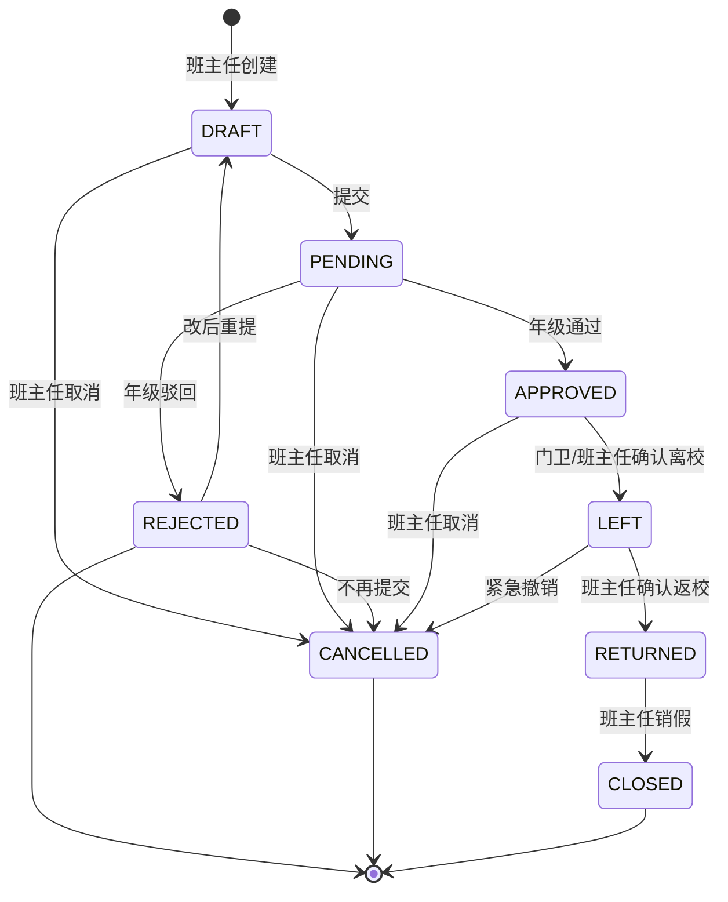

# Sprint 2 Planning v4.2 — Business Rule Patch（业务规则补丁）

> Version：4.2 — **v4.1 的业务规则修正**
> Project：SmartGrade 智慧年级管理平台
> Status：**业务规则冻结（Business Rule Freeze）**
> Author：Trae（基于刘老师 2026-07-18 第五轮业务规则反馈）
> Date：2026-07-18
> 历史版本：[v1](./SPRINT2_PLANNING_v1.md) · [v2.bak](./SPRINT2_PLANNING_v2.md.bak) · [v3.bak](./SPRINT2_PLANNING_v3.md.bak) · [v4.bak](./SPRINT2_PLANNING_v4.md) · [v4.1.bak](./SPRINT2_PLANNING_v4.1.md)

---

## 文档目的

v4.1 引入的请假状态机**偏企业考勤系统思维**，不完全符合高中校园实际。

v4.2 是一次**业务规则校准**，不是技术改动：
1. 删除 3 个"自动异常类"状态：`EXPIRED` / `OVERDUE` / `NO_SHOW`
2. 请假状态机从 11 状态**冻结为 8 状态**
3. LeaveTimeline 从 13 事件**冻结为 10 事件**
4. 明确产品定位：**学生状态中心**，不是请假管理系统
5. 重新定义班主任/年级主任/门卫 职责边界

> v4.2 不修改 v4.1 任何技术冻结（实体、权限、接口、Auth、NotificationTarget）。
> v4.2 仅**修改业务规则冻结**（状态机、Timeline 事件类型）。

---

# 第一章 业务规则校正（v4.2 核心）

## 1.1 根本问题

v4.1 设计的请假状态机：

```
APPROVED → NO_SHOW    (超过 30 分钟未离校)     ❌ 删除
APPROVED → EXPIRED    (超过 end_at + 1h)       ❌ 删除
LEFT → OVERDUE        (超过预计返校时间)        ❌ 删除
```

> 这些规则更像**企业考勤系统**，不符合高中实际。

## 1.2 高中请假的真实场景

```text
08:30  班主任提交请假
09:00  年级主任审批通过
10:00  学生从教室离开（门卫登记）
  ↓
  学生可能：
  - 上午回家休息（病假）
  - 下午才离校
  - 中途返校后又出去
  ↓
  ⏰ 关键：返校时间由班主任/宿管确认，不是系统判断
  ↓
  病愈返校
17:30  班主任确认返校
17:40  销假
```

**核心原则**：
- ✅ 班主任发起 → 年级审批 → 门卫离校 → 班主任销假
- ❌ 系统**不自动**判断"逾期"、"过期"、"未到"
- ❌ 返校时间由**人确认**，不由系统计时

## 1.3 重新定义产品定位

> ❌ **不是**：「请假管理系统」「学生考勤系统」
> ✅ **而是**：「**学生在校状态中心**」

请假、离校、住宿三个模块**统一**为"学生状态中心"：

```
            学生状态中心
                │
   ┌────────────┼────────────┐
   │            │            │
   请假        离校         住宿
   (审批)      (门卫登记)   (查寝)
   │            │            │
   └────────────┴────────────┘
                │
           状态恢复（销假）
```

---

# 第二章 请假状态机 v4.2（8 状态 - 冻结）

## 2.1 8 状态定义

| # | 状态 | Key | 含义 | 触发者 |
|---|---|---|---|---|
| 1 | 草稿 | `DRAFT` | 班主任填写中 | 班主任 |
| 2 | 待审批 | `PENDING` | 已提交待审核 | 系统 |
| 3 | 已批准 | `APPROVED` | 年级通过，待离校 | 年级主任 |
| 4 | 已驳回 | `REJECTED` | 年级驳回，可改后重提 | 年级主任 |
| 5 | 已取消 | `CANCELLED` | 班主任主动取消 | 班主任 |
| 6 | 已离校 | `LEFT` | 门卫/班主任确认离开 | 门卫/班主任 |
| 7 | 已返校 | `RETURNED` | 班主任确认回校 | 班主任 |
| 8 | 已销假 | `CLOSED` | 班主任销假 | 班主任 |

> **冻结声明**：8 状态机冻结。不允许新增顶层状态。

## 2.2 状态机图



## 2.3 v4.1 → v4.2 状态变更

| v4.1 状态 | v4.2 状态 | 说明 |
|---|---|---|
| `DRAFT` | `DRAFT` | 保留 |
| `PENDING` | `PENDING` | 保留 |
| `APPROVED` | `APPROVED` | 保留 |
| `REJECTED` | `REJECTED` | 保留 |
| `CANCELLED` | `CANCELLED` | 保留 |
| `LEFT` | `LEFT` | 保留 |
| `RETURNED` | `RETURNED` | 保留 |
| `CLOSED` | `CLOSED` | 保留 |
| ~~`NO_SHOW`~~ | ❌ 删除 | 系统不自动判断 |
| ~~`EXPIRED`~~ | ❌ 删除 | 高中请假无过期概念 |
| ~~`OVERDUE`~~ | ❌ 删除 | 返校由人确认 |

## 2.4 状态机业务规则

| 规则 | 描述 |
|---|---|
| `APPROVED → LEFT` | 门卫或班主任手动确认（**不强校验**离校时间） |
| `LEFT → RETURNED` | 班主任手动确认返校 |
| `RETURNED → CLOSED` | 班主任手动销假 |
| **不**自动 | `APPROVED → NO_SHOW`（删除） |
| **不**自动 | `APPROVED → EXPIRED`（删除） |
| **不**自动 | `LEFT → OVERDUE`（删除） |
| **不**自动 | `APPROVED → EXPIRED`（删除） |

---

# 第三章 expected_return_time 字段调整

## 3.1 字段定义（不变）

```typescript
interface LeaveRecord {
  // ... 其他字段
  start_at: Date;                  // 实际开始时间
  end_at: Date;                    // 请假结束时间
  expected_return_time?: Date;     // 预计返校时间（可选）
  expected_return_note?: string;   // 预计返校备注（如"病愈即返"）
}
```

## 3.2 字段语义（v4.2 修正）

> **关键**：`expected_return_time` 仅作为**参考信息**。
> **不**参与任何自动状态转换。

| 用法 | 描述 |
|---|---|
| ✅ 显示在请假详情 | "预计返校时间：7月20日 08:00" |
| ✅ 显示在班级看板 | "今日待返校 1 人" |
| ✅ 作为统计依据 | "本月按时返校率 95%" |
| ✅ 作为工作台提醒 | "今日有 1 名学生预计返校" |
| ❌ 自动触发状态 | ~~`LEFT → OVERDUE`~~（**禁止**） |
| ❌ 自动告警 | ~~"逾期 3 小时未返校"~~（**禁止**） |

## 3.3 返校统计（v4.2 新增）

```typescript
interface LeaveReturnStats {
  student_id: string;
  // 准时返校：RETURNED 实际返校时间 ≤ expected_return_time + 24h
  on_time_count: number;
  // 延期返校：RETURNED 实际返校时间 > expected_return_time + 24h
  delayed_count: number;
  // 提前返校：RETURNED 实际返校时间 < expected_return_time
  early_count: number;
}
```

---

# 第四章 LeaveTimeline v4.2（10 事件 - 冻结）

## 4.1 10 个事件类型

```typescript
type LeaveTimelineEventType =
  | 'LEAVE_CREATED'      // 班主任创建
  | 'LEAVE_SUBMITTED'    // 提交
  | 'LEAVE_APPROVED'     // 年级通过
  | 'LEAVE_REJECTED'     // 年级驳回
  | 'LEAVE_CANCELLED'    // 班主任取消
  | 'LEAVE_GATE_LEFT'    // 门卫/班主任确认离校
  | 'LEAVE_RETURNED'     // 班主任确认返校
  | 'LEAVE_CLOSED'       // 销假
  | 'LEAVE_EDITED'       // 班主任修改请假内容
  | 'LEAVE_RESUBMITTED'; // 改后重提
```

## 4.2 v4.1 → v4.2 Timeline 变更

| v4.1 事件 | v4.2 事件 | 说明 |
|---|---|---|
| `LEAVE_CREATED` | `LEAVE_CREATED` | 保留 |
| `LEAVE_SUBMITTED` | `LEAVE_SUBMITTED` | 保留 |
| `LEAVE_APPROVED` | `LEAVE_APPROVED` | 保留 |
| `LEAVE_REJECTED` | `LEAVE_REJECTED` | 保留 |
| `LEAVE_REVOKED` | `LEAVE_CANCELLED` | 改名（语义统一） |
| `LEAVE_GATE_LEFT` | `LEAVE_GATE_LEFT` | 保留 |
| `LEAVE_RETURNED` | `LEAVE_RETURNED` | 保留 |
| `LEAVE_CLOSED` | `LEAVE_CLOSED` | 保留 |
| `LEAVE_NO_SHOW` | ❌ 删除 | 不自动异常 |
| `LEAVE_EXPIRED` | ❌ 删除 | 不自动过期 |
| `LEAVE_OVERDUE` | ❌ 删除 | 不自动逾期 |
| `LEAVE_LATE_RETURN` | ❌ 删除 | 改为统计字段 |
| **新增** | `LEAVE_EDITED` | 班主任修改 |
| **新增** | `LEAVE_RESUBMITTED` | 改后重提 |

> **冻结声明**：10 事件冻结。允许扩展子类型，不允许新增顶层类型。

## 4.3 一次完整请假的时间轴（v4.2 示例）

```text
【学生】张三 - 病假 1天 - 2026-07-18
━━━━━━━━━━━━━━━━━━━━━━━━━━━━━━━━━
08:30  班主任(李老师) 创建请假          LEAVE_CREATED
08:32  班主任(李老师) 提交审批          LEAVE_SUBMITTED
08:35  年级主任(王主任) 审批通过        LEAVE_APPROVED
10:00  门卫(张师傅) 确认离校            LEAVE_GATE_LEFT
17:30  班主任(李老师) 确认返校          LEAVE_RETURNED
17:35  班主任(李老师) 销假              LEAVE_CLOSED

预期返校时间：2026-07-19 08:00
实际返校时间：2026-07-18 17:30
返校判定：提前返校（-14.5h）
━━━━━━━━━━━━━━━━━━━━━━━━━━━━━━━━━
```

---

# 第五章 角色职责边界（v4.2 重新定义）

## 5.1 班主任

**核心动作**：创建请假 + 确认离校 + 确认返校 + 销假

```text
学生状态变化的所有节点，班主任都参与：

创建请假 ──→ 修改内容 ──→ 提交 ──→ 看到驳回 ──→ 改后重提
   ↓
确认离校（已批准但未走门卫时，可手动登记）
   ↓
学生返校 ──→ 确认返校 ──→ 销假
```

**关键**：
- 班主任是请假流程的**主导者**
- 班主任在每一步都能**主动干预**
- 班主任决定**何时**算"返校"

## 5.2 年级主任

**核心动作**：审批（通过 / 驳回）

```text
PENDING ──→ APPROVED  (通过)
       └──→ REJECTED   (驳回)
```

**关键**：
- 年级主任**不**参与离校、返校、销假
- 年级主任**不**跟踪后续状态

## 5.3 门卫 / 值班老师

**核心动作**：确认离校

```text
APPROVED ──→ LEFT  (门卫扫码或人工登记)
```

**关键**：
- 门卫**不**是审批者
- 门卫只负责"物理离校确认"
- 门卫**不**参与审批、返校、销假

> 这是 v4.2 与企业考勤系统的**本质区别**：
> - 企业考勤：门禁 = 强校验、自动状态变更
> - 高中实际：门卫 = 信息登记，状态由班主任确认

## 5.4 宿管

**核心动作**：查寝（不参与请假）

```text
上午查寝 / 晚间查寝
```

**关键**：
- 宿管**不**直接参与请假流程
- 宿管查寝时自动过滤"已批准+未返校"学生

## 5.5 家长

**核心动作**：接收通知

```text
接收 ──→ 已读 ──→ 强制已读确认（可选）
```

---

# 第六章 学生状态中心（v4.2 新增顶层概念）

## 6.1 重新定义产品核心

> ❌ **不是**：「请假管理系统」「学生考勤系统」
> ✅ **而是**：「**学生在校状态中心**」

## 6.2 学生状态的统一视图

```
         ┌──────────────────────────────┐
         │     StudentStatusCenter       │
         │     学生在校状态中心           │
         └──────────────┬───────────────┘
                        │
       ┌────────────────┼────────────────┐
       │                │                │
   ┌───▼────┐      ┌────▼─────┐    ┌─────▼────┐
   │ Leave  │      │ Gate     │    │ Dorm     │
   │ 请假   │      │ 离校     │    │ 住宿     │
   │(审批)  │      │(门卫)    │    │(查寝)    │
   └───┬────┘      └────┬─────┘    └─────┬────┘
       │                │                │
       └────────────────┴────────────────┘
                        │
                  状态恢复（销假）
                        │
                  Student.current_status
                  (IN_SCHOOL / LEFT_SCHOOL)
```

## 6.3 三个子模块的边界

| 子模块 | 入口 | 状态变更 | 强校验 |
|---|---|---|---|
| **请假** | 班主任 | DRAFT → PENDING → APPROVED → ... | 班主任可随时取消 |
| **离校** | 门卫/班主任 | APPROVED → LEFT | 门卫可人工登记 |
| **住宿** | 宿管 | (不参与请假状态) | 仅查寝登记 |

> 三个模块**互不重叠**，但共享**Student.current_status**。

## 6.4 实际在校人数计算（v4.2 修正）

```typescript
// 今日应到
in_school_today = 班级人数 - 走读生

// 今日实到
actually_in_school = in_school_today 
  - APPROVED 且未到 LEFT（预计今日返校的学生暂算"应在校"）
  - LEFT（已离校）

// 注意：
// 1. 病假一天的学生，预期返校时间在今日，仍算"今日应在校"
// 2. 已 LEFT 但未 RETURNED，按"已离校"计算
// 3. 班主任手动确认 RETURNED 后才回到"在校"
```

---

# 第七章 v4.2 不修改的内容

> **明确**：v4.2 不修改 v4 / v4.1 的技术冻结。

| v4/v4.1 冻结 | v4.2 状态 |
|---|---|
| 7 实体（School/Grade/Class/User/Teacher/Student/Parent） | 不变 |
| UserIdentity 实体 | 不变 |
| 6+2 双体系角色 | 不变 |
| 52+9 权限点 | 不变 |
| AuthRequest 3 策略 | 不变 |
| NotificationTarget 8 类型 | 不变 |
| WorkbenchOverview / WorkbenchTodo 接口 | 不变 |
| 家长端"学生行为记录"展示 | 不变 |
| 14 天开发顺序 | 不变 |
| 8 项排除（成绩管理等） | 不变 |

> v4.2 仅修改 2 个对象：
> 1. **请假状态机**：11 → 8
> 2. **LeaveTimeline**：13 → 10

---

# 第八章 v4.2 Review 检查表（10 项）

> 启动 Sprint 2.1 编码前最终自检。

## 8.1 状态机

- [ ] 8 状态已定义（DRAFT/PENDING/APPROVED/REJECTED/CANCELLED/LEFT/RETURNED/CLOSED）
- [ ] NO_SHOW / EXPIRED / OVERDUE 已删除
- [ ] 状态机不允许新增顶层状态

## 8.2 Timeline 事件

- [ ] 10 事件已定义
- [ ] NO_SHOW / EXPIRED / OVERDUE / LATE_RETURN 已删除
- [ ] 改为 LEAVE_EDITED / LEAVE_RESUBMITTED

## 8.3 字段

- [ ] expected_return_time 仅参考字段
- [ ] 不参与自动状态转换
- [ ] 不参与自动告警
- [ ] 仅作为统计/工作台提醒依据

## 8.4 角色职责

- [ ] 班主任 = 创建 + 离校 + 返校 + 销假（主导者）
- [ ] 年级主任 = 审批（通过/驳回）
- [ ] 门卫 = 离校登记（不是审批者）
- [ ] 宿管 = 查寝（不参与请假）

## 8.5 产品定位

- [ ] 「学生在校状态中心」定位明确
- [ ] 「请假管理系统」定位已废弃
- [ ] 请假/离校/住宿三模块边界清晰

## 8.6 v4.2 Review 补充冻结项（升 v1.1）

> v4.2 业务规则补丁通过 Review 后，**追加 4 条冻结**（Domain Rule 升 v1.1）。

- [ ] **`leave_reason_type` 6 枚举**（ILLNESS / PERSONAL / FAMILY / SPORT / SCHOOL_ACTIVITY / OTHER）
- [ ] **`StudentStatus` 6 状态**（ON_CAMPUS / LEAVING / OUT_OF_SCHOOL / DORM / GRADUATED / TRANSFERRED）
- [ ] **业务事件驱动原则**（模块不直接改 `Student.current_status`，由 Timeline 事件触发）
- [ ] **`StudentTimeline` 21 事件 + 聚合视图架构**（Sprint 3 AI 启用）

## 8.7 v4.2 Review 二次优化（升 v1.2 - 业务负责人最终拍板）

> 业务负责人提出：状态 ≠ 位置。Day 1 前必须拆分，避免未来重构。

- [ ] **`StudentStatus` 重写为 4 状态**（ON_CAMPUS / OUT_OF_SCHOOL / GRADUATED / TRANSFERRED，删除 `LEAVING` 和 `DORM`）
- [ ] **新增 `StudentLocation` 6 位置**（CLASSROOM / DORM / PLAYGROUND / GATE / OFF_CAMPUS / UNKNOWN）
- [ ] **双维度独立字段**（`Student.current_status` + `Student.current_location`）
- [ ] **双维度判断逻辑**（`isActuallyInSchool` / `shouldCheckInDorm`）

---

# 第九章 评审结论

## 9.1 v4.2 通过条件

- [x] 状态机 8 状态冻结
- [x] Timeline 10 事件冻结
- [x] expected_return_time 语义冻结
- [x] 角色职责边界冻结
- [x] 产品定位"学生状态中心"冻结

## 9.2 启动承诺

> **Sprint 2.1 启动后**：
> - 业务规则（请假状态机 / Timeline 事件 / 角色职责 / 字段语义）**不允许修改**
> - 任何业务调整必须经过 Project Rule 修订流程
> - 后续 Sprint 2.2+ 仅允许扩展，不允许破坏 v4.2 业务规则

## 9.3 第一闭环（v4.2 校准后）

```
班主任登录小程序
  ↓
创建学生请假
  ↓
提交年级审批
  ↓
年级通过 / 驳回
  ↓
[通过] 学生离校（门卫或班主任登记）
  ↓
班主任看到「已离校」
  ↓
[病愈] 学生返校（班主任确认）
  ↓
班主任销假
  ↓
家长收到完整状态通知
```

> 这个闭环跑通，整个产品就真正"活"起来了。

---

# 第十章 SPRINT2_DOMAIN_RULE_v1.md（独立业务规则文档）

> 单独冻结一份业务规则文档，供后续开发、测试、运维使用。

文件路径：`/workspace/SmartGrade/docs/SPRINT2_DOMAIN_RULE_v1.md`

## 10.1 内容预告

| 章节 | 内容 |
|---|---|
| 1 | 请假规则（含状态机、T 事件、字段语义） |
| 2 | 离校规则（门卫登记、班主任手动登记） |
| 3 | 通知规则（生命周期、阅读统计、强制已读） |
| 4 | 任务规则（创建、分派、催办、自动提醒） |
| 5 | 宿舍规则（查寝、缺寝、自动过滤） |
| 6 | 违纪规则（状态机、家长端"学生行为记录"） |
| 7 | 权限规则（6+2 双体系） |
| 8 | 通用规则（Timeline、永久留痕、家长仅接收） |

> 完整版将在 v4.2 启动后第 1 天（Day 1）输出。

---

# 附录 A：变更决策记录

| 版本 | 决策 | 来源 |
|---|---|---|
| v1 | 8 Step / 5 角色 / 31 权限 | 初步规划 |
| v2 | 7 Step / 7 角色 / 46 权限 | 第二轮评审 |
| v3 | 7 Step / 6+2 双层 / 工作台前置 | 第三轮评审 |
| v4 | 冻结 7 实体 / 11 状态 | 第四轮冻结 |
| v4.1 | UserIdentity / LeaveTimeline 13 类型 / 14 天顺序 | 工程补丁 |
| **v4.2** | **请假状态机 11→8 / Timeline 13→10 / 学生状态中心** | **业务规则补丁** |
| **Domain Rule v1.0** | **业务规则首次冻结**（请假/离校/通知/任务/宿舍/违纪/权限/通用 8 章） | **v4.2 落定** |
| **Domain Rule v1.1** | **v4.2 Review 补充 4 条**（`leave_reason_type` 6 枚举 / `StudentStatus` 6 状态 / 业务事件驱动 / `StudentTimeline` 21 事件） | **v4.2 Review** |
| **Domain Rule v1.2** | **业务负责人最终拍板：双维度模型拆分**（`StudentStatus` 6→4 状态 / 新增 `StudentLocation` 6 位置 / 双维度独立字段） | **本次 Review（Day 1 前）** |

---

# 附录 B：术语最终版（v4.2 锁定）

| 术语 | 含义 | 反例 |
|---|---|---|
| **学生在校状态中心** | 产品核心定位 | ❌ 请假管理系统 |
| **8 状态请假机** | DRAFT→PENDING→APPROVED→LEFT→RETURNED→CLOSED + REJECTED/CANCELLED | ❌ 11 状态（含 NO_SHOW/EXPIRED/OVERDUE） |
| **expected_return_time** | 仅参考字段 | ❌ 自动触发 OVERDUE |
| **班主任主导者** | 创建+离校+返校+销假 | ❌ 系统自动判断 |
| **门卫非审批者** | 仅物理离校登记 | ❌ 门卫审批 |
| **返校由人确认** | 班主任手动 | ❌ 系统自动 |
| **Sprint 2.1 启动前** | 必须完成 v4.2 业务规则 Review | ❌ 直接编码 |

---

**v4.2 业务规则冻结。Sprint 2.1 启动前必须完成 SPRINT2_DOMAIN_RULE_v1.md。**

— End of Sprint 2 Planning v4.2 (Business Rule Patch) —
