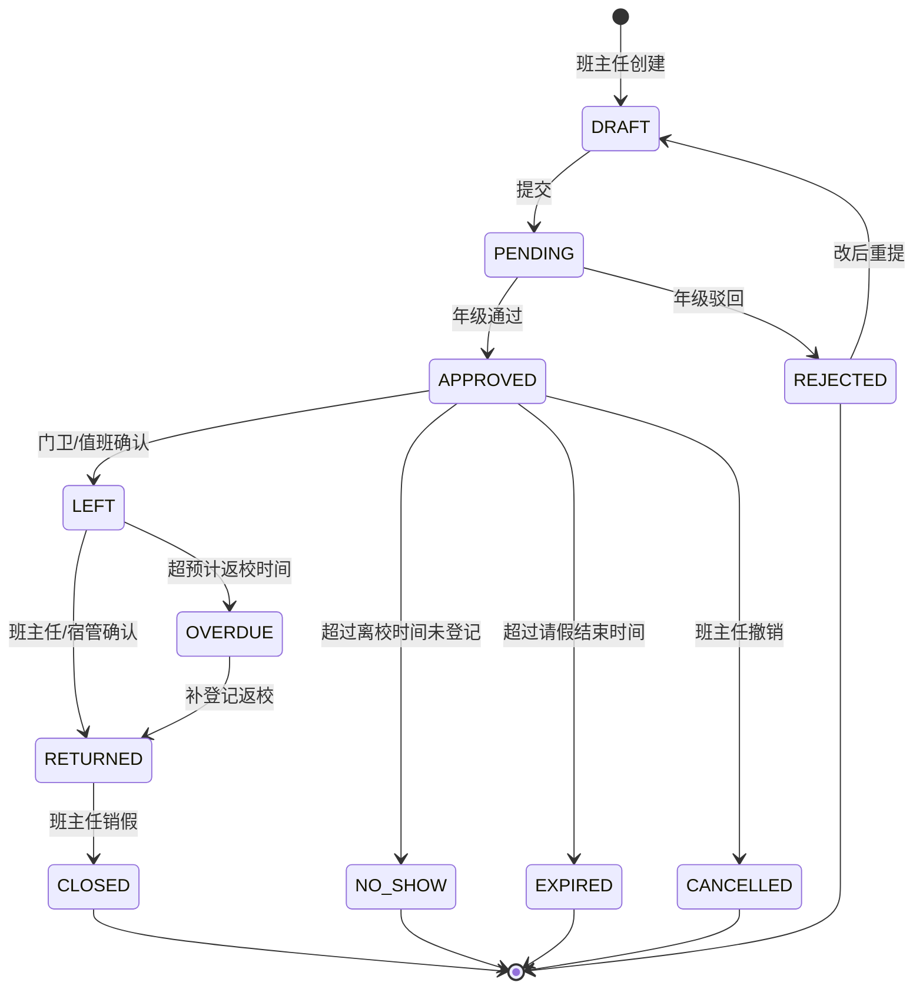

# Sprint 2 Planning v4 — Product Freeze（产品冻结版）

> Version：4.0 — **产品冻结版（Product Freeze）**
> Project：SmartGrade 智慧年级管理平台
> Status：**正式开发基线**（Sprint 2.1 启动前最终版）
> Author：Trae（基于刘老师 2026-07-18 第四轮产品冻结反馈）
> Date：2026-07-18
> 历史版本：[v1](./SPRINT2_PLANNING_v1.md) · [v2.bak](./SPRINT2_PLANNING_v2.md.bak) · [v3.bak](./SPRINT2_PLANNING_v3.md.bak)

---

## 文档目的

v4 是 **Sprint 2.1 启动前的最后一份规划**。

它不是新设计，而是在 v3 基础上**对 6 个未定型点执行产品冻结（Product Freeze）**，确保后续编码不再回头修改基础数据模型与权限体系。

**冻结原则**：
- 数据模型一旦冻结，不允许因新功能再次修改字段类型
- 状态机一旦冻结，不允许新增状态（仅允许扩展子状态）
- 角色 / 权限位一旦冻结，不允许新增
- 接口一旦冻结，签名不允许修改（仅允许新增）

> 一旦 v4 评审通过，Sprint 2.1 即可启动编码。

---

# 第一章 v4 冻结清单（与 v3 对比）

| # | 冻结项 | v3 状态 | v4 冻结结果 |
|---|---|---|---|
| 1 | 基础数据 | 缺 School / Grade | **新增 School、Grade 实体** |
| 2 | 角色体系 | 双层（6+2） | **保持不变**（明确冻结） |
| 3 | 请假状态机 | 9 状态 | **预留 NO_SHOW / EXPIRED**（9 + 2 = 11 状态） |
| 4 | 通知发送对象 | 硬编码三类 | **新增 NotificationTarget 模型** |
| 5 | 工作台接口 | 概念定义 | **签名冻结**（WorkbenchOverview / WorkbenchTodo） |
| 6 | 成绩管理 | 排除 | **明确冻结**（Sprint 2 不做） |
| 7 | 家长能力 | 4 个 | **+1（parent.leave.view）** = 5 个 |
| 8 | Auth 设计 | 单一 | **抽象化**（手机号/微信/账号 三种策略） |

---

# 第二章 基础数据模型冻结（v4 核心调整 1）

> v3 已定义 User/Teacher/Class/Student/Parent。
> v4 **新增 School 与 Grade**，并把"学校→年级→班级→学生"四级树补全。

## 2.1 实体关系（v4 完整版）

```mermaid
erDiagram
    School ||--o{ Grade : 包含
    Grade ||--o{ Class : 包含
    Class ||--o{ Student : 拥有
    School ||--o{ Teacher : 隶属
    Grade ||--o{ Teacher : 管辖
    Class }o--|| Teacher : head_teacher
    Student ||--o{ LeaveRecord : 申请
    Student ||--o{ IncidentReport : 涉及
    Student ||--o{ TimelineEvent : 拥有
    Student }o--o{ Parent : 关联
    Student }o--o| Bed : 分配
    DormBuilding ||--o{ DormRoom : 包含
    DormRoom ||--o{ Bed : 包含
    Teacher ||--o{ TaskAssignee : 接收
    Teacher ||--o{ Notice : 发布
    Notice ||--o{ NotificationTarget : 发送目标
    Notice ||--o{ NoticeReceipt : 触达
    Task ||--o{ TaskAssignee : 分派
```

## 2.2 School（学校 - v4 新增）

```typescript
interface School {
  school_id: string;          // 主键
  name: string;                // 例：辽东湾实验高级中学
  code: string;                // 机构代码
  logo_url?: string;
  address?: string;
  contact_phone?: string;
  status: 'ACTIVE' | 'DISABLED';
  created_at: Date;
}
```

**冻结理由**：当前虽然单校，但产品化必须留。一个平台多校是 SaaS 化的必然方向。

## 2.3 Grade（年级 - v4 新增）

```typescript
interface Grade {
  grade_id: string;
  school_id: string;           // 所属学校
  school_year: string;         // 学年 例：2026-2027
  name: string;                // 例：高一年级
  grade_number: number;        // 1/2/3
  leader_id?: string;          // 年级主任
  leader_name?: string;
  student_count: number;
  class_count: number;
  status: 'ACTIVE' | 'GRADUATED';
  created_at: Date;
}
```

**冻结理由**：
- 年级主任的 DataScope 直接绑定 Grade
- 不应从 Class 推断（多 Class 跨 Grade 会出现数据冲突）
- 学年（school_year）字段支持多年共存

## 2.4 Class（v4 微调 - 增加 school_id / grade_id）

```typescript
interface Class {
  class_id: string;
  school_id: string;           // v4 新增
  grade_id: string;            // v4 新增
  class_name: string;
  grade_name: string;          // 冗余便于查询
  head_teacher_id: string;
  head_teacher_name: string;
  student_count: number;
  monitor_id?: string;
  entry_year: number;
  status: 'ACTIVE' | 'GRADUATED';
}
```

## 2.5 User（v4 不变）

```typescript
interface User {
  id: string;
  name: string;
  phone: string;
  avatar?: string;
  email?: string;
  wechat_openid?: string;
  wechat_unionid?: string;
  status: 'ACTIVE' | 'DISABLED' | 'PENDING';
  created_at: Date;
  updated_at: Date;
  last_login_at?: Date;
}
```

## 2.6 Teacher（v4 微调 - 增加 school_id / grades）

```typescript
interface Teacher {
  teacher_id: string;
  user_id: string;
  school_id: string;            // v4 新增（单校时冗余，未来多校必需）
  teacher_no: string;
  name: string;
  gender: 'MALE' | 'FEMALE';
  phone: string;
  department?: string;          // 部门（年级组/教研组）
  subject?: string;             // 任教学科
  title?: string;
  // 多角色
  roles: Array<'SUPER_ADMIN' | 'GRADE_ADMIN' | 'POLITICAL_ADMIN' | 'HEAD_TEACHER' | 'SUBJECT_TEACHER' | 'DORM_ADMIN'>;
  role_assignments: Array<{
    role: string;
    scope_type: 'SCHOOL' | 'GRADE' | 'CLASS' | 'DORM';
    scope_id: string;
  }>;
  tags: string[];
  status: 'ACTIVE' | 'LEAVE' | 'RESIGNED';
}
```

## 2.7 Student（v4 微调 - 冗余 school_id / grade_name）

```typescript
interface Student {
  student_id: string;
  user_id: string;
  school_id: string;            // v4 新增
  grade_id: string;             // v4 新增
  class_id: string;
  class_name: string;           // 冗余
  grade_name: string;           // v4 新增
  student_no: string;
  name: string;
  gender: 'MALE' | 'FEMALE';
  parent_ids: string[];
  parent_phones: string[];
  boarding_type: 'BOARDING' | 'DAY';
  dorm_room_id?: string;
  bed_id?: string;
  avatar?: string;
  birth_date?: Date;
  enrollment_year: number;
  current_status: 'IN_SCHOOL' | 'PENDING_LEAVE' | 'LEFT_SCHOOL' | 'SUSPENDED' | 'GRADUATED';
  status: 'ACTIVE' | 'TRANSFERRED' | 'GRADUATED';
}
```

## 2.8 Parent（v4 不变）

```typescript
interface Parent {
  parent_id: string;
  user_id: string;
  name: string;
  phone: string;
  student_ids: string[];
  relationship: 'FATHER' | 'MOTHER' | 'GRANDPARENT' | 'GUARDIAN';
  notify_preference: {
    channels: Array<'WECHAT' | 'SMS' | 'IN_APP'>;
    categories: {
      leave: boolean;
      incident: boolean;
      notice: boolean;
      safety: boolean;
    };
    quiet_hours?: { start: string; end: string };
  };
  is_primary: boolean;
}
```

## 2.9 实体统计

| 实体 | 数量 | 状态 |
|---|---|---|
| School | 1（单校） | v4 新增 |
| Grade | 3（高1/2/3） | v4 新增 |
| Class | 多 | 增强 |
| User | — | 不变 |
| Teacher | 多 | 增强 |
| Student | 多 | 增强 |
| Parent | 多 | 不变 |
| **共 7 个核心实体** | | **冻结** |

---

# 第三章 角色体系冻结（v4 核心调整 2）

> v3 双体系设计 v4 **完全冻结**，不允许修改。

## 3.1 管理端角色（6 类 - 冻结）

```
SUPER_ADMIN
GRADE_ADMIN
POLITICAL_ADMIN
HEAD_TEACHER
SUBJECT_TEACHER
DORM_ADMIN
```

## 3.2 用户端能力位（v4 增加 1 个）

| v3 能力位 | v4 状态 |
|---|---|
| `parent.notice.receive` | 保留 |
| `parent.notice.acknowledge` | 保留 |
| `parent.leave_record.view` | 保留 |
| **`parent.leave.view`** | **v4 新增**（家长查看请假结果） |
| `parent.incident.view` | 保留 |
| `parent.preference.set` | 保留 |
| `student.notice.receive` | 保留 |
| `student.leave.view` | 保留 |
| `student.profile.view` | 保留 |

**家长能力位总数**：6 个（v3 5 个 + 1 个 = **6 个**）

## 3.3 角色权限点（v4 冻结 52 个 + 用户端 9 个 = 61 个）

```
管理端 RBAC：52 个
  ├── DASHBOARD_*    2
  ├── TODO_*         2
  ├── LEAVE_*        8（含 v4 新增 LEAVE_GATE_RECORD / LEAVE_OVERDUE_HANDLE）
  ├── NOTICE_*       8（含 v4 强化）
  ├── STUDENT_*      4
  ├── TEACHER_*      6
  ├── DORM_*         2
  ├── TASK_*         6
  ├── PERMISSION_*   4
  ├── ROLE_*         4
  ├── WORKBENCH_*    3（v3 新增）
  └── INCIDENT_*     3

用户端能力位：9 个
  ├── parent.*       6
  └── student.*      3
```

---

# 第四章 请假状态机冻结（v4 核心调整 3）

> v3 有 9 个状态。v4 **预留 NO_SHOW / EXPIRED**，共 11 个状态。

## 4.1 11 状态定义

| # | 状态 | Key | 含义 | 触发者 |
|---|---|---|---|---|
| 1 | 草稿 | `DRAFT` | 班主任填写中 | 班主任 |
| 2 | 待审批 | `PENDING` | 已提交待审核 | 系统 |
| 3 | 已批准 | `APPROVED` | 年级通过，待离校 | 年级主任 |
| 4 | 已驳回 | `REJECTED` | 年级驳回，可改后重提 | 年级主任 |
| 5 | 已离校 | `LEFT` | 门卫/值班确认离开 | 门卫/值班 |
| 6 | 已返校 | `RETURNED` | 班主任/宿管确认回校 | 班主任/宿管 |
| 7 | 已销假 | `CLOSED` | 班主任销假 | 班主任 |
| 8 | 已撤销 | `CANCELLED` | 班主任主动撤销 | 班主任 |
| 9 | 逾期未返 | `OVERDUE` | 超过预计返校时间 | 系统 |
| **10** | **未离校** | **`NO_SHOW`** | **v4 新增：已批准但实际未离校** | **系统/门卫** |
| **11** | **已过期** | **`EXPIRED`** | **v4 新增：超过请假结束时间仍未操作** | **系统** |

## 4.2 状态机（v4 完整版）



## 4.3 业务规则

| 规则 | 描述 |
|---|---|
| `APPROVED → LEFT` | 门卫/值班必须确认（强校验） |
| `APPROVED → NO_SHOW` | 超过 `start_at + 30min` 仍未离校登记 |
| `APPROVED → EXPIRED` | 超过 `end_at + 1h` 仍未操作 |
| `LEFT → OVERDUE` | 超过 `end_at` 仍未返校 |
| `NO_SHOW / EXPIRED` | 不计入"实际在校"统计（仍按 LEFT 处理） |

## 4.4 状态机冻结声明

> **11 状态机冻结**：后续 Sprint 不允许新增顶层状态，仅允许在现有状态下扩展子状态。
> 任何业务调整必须通过 Project Rule 修订流程，不得绕过。

---

# 第五章 通知中心冻结（v4 核心调整 4）

> v3 通知硬编码三类（年级/班级/教师）。v4 **引入 NotificationTarget 模型**，解耦通知与发送对象。

## 5.1 NotificationTarget 模型（v4 新增）

```typescript
type NotificationTargetType = 
  | 'SCHOOL'      // 全校
  | 'GRADE'       // 全年级
  | 'CLASS'       // 全班
  | 'ROLE'        // 某角色
  | 'USER'        // 单个用户
  | 'STUDENT'     // 单个学生
  | 'PARENT'      // 单个家长
  | 'TAG';        // 标签

interface NotificationTarget {
  target_id: string;
  notice_id: string;
  target_type: NotificationTargetType;
  target_id_value: string;       // 对应实体的 ID
  // 冗余查询字段
  target_name?: string;
  target_count?: number;        // 接收人数（GROUP 类型时）
}
```

## 5.2 通知主表（v4 强化）

```typescript
interface Notice {
  notice_id: string;
  school_id: string;            // v4 新增
  type: 'GRADE' | 'CLASS' | 'TASK' | 'SAFETY' | 'POLITICAL';
  title: string;
  content: string;
  attachments: string[];
  sender_id: string;
  sender_name: string;
  sender_role: string;
  // 发送范围（v4 解耦）
  targets: NotificationTarget[];
  template_id?: string;
  scheduled_at?: Date;
  sent_at?: Date;
  withdrawn_at?: Date;
  is_force_read: boolean;
  read_window_hours: number;
  expire_at?: Date;
  status: 'DRAFT' | 'SCHEDULED' | 'SENT' | 'READING' | 'ARCHIVED' | 'WITHDRAWN';
}
```

## 5.3 灵活使用示例

```typescript
// 例 1：年级主任向全年级家长发布
notice.targets = [
  { target_type: 'GRADE', target_id_value: 'grade_001' }
];

// 例 2：班主任向本班家长发布
notice.targets = [
  { target_type: 'CLASS', target_id_value: 'class_011' }
];

// 例 3：年级主任向所有班主任发布
notice.targets = [
  { target_type: 'GRADE', target_id_value: 'grade_001' },
  { target_type: 'ROLE', target_id_value: 'HEAD_TEACHER' }
];

// 例 4：政教向所有家长发布安全通知
notice.targets = [
  { target_type: 'SCHOOL', target_id_value: 'school_001' },
  { target_type: 'ROLE', target_id_value: 'PARENT' }
];
```

**冻结价值**：未来新增"通知所有党员教师"等需求，**无需修改通知主表**，仅扩展 `NotificationTargetType` 联合类型。

---

# 第六章 工作台接口冻结（v4 核心调整 5）

> v3 概念定义，v4 冻结签名。

## 6.1 接口签名（冻结）

```typescript
// GET /api/v1/workbench/overview
interface WorkbenchOverview {
  user_id: string;
  user_role: string;
  date: string;                       // YYYY-MM-DD

  // 班级数据（班主任）
  class_id?: string;
  class_name?: string;
  class_size?: number;                // 班级人数
  in_school?: number;                 // 在校人数
  left_today?: number;                // 今日离校
  pending_leave?: number;             // 待处理请假
  incidents_today?: number;           // 今日违纪
  notices_unread?: number;            // 未读通知
  tasks_active?: number;              // 进行中任务

  // 年级数据（年级主任）
  grade_id?: string;
  grade_name?: string;
  pending_approvals?: number;         // 待审批请假
  grade_leave_today?: number;         // 今日年级请假
  grade_left_today?: number;          // 今日年级离校
  grade_undone_tasks?: number;        // 未完成任务数

  // 宿管数据
  dorm_pending_rollcall?: number;     // 待查寝数
  dorm_absent_today?: number;         // 今日缺寝

  server_time: string;                // 服务端时间
}

// GET /api/v1/workbench/todos
interface WorkbenchTodo {
  todo_id: string;
  type: 'LEAVE_PENDING' | 'LEAVE_RETURN' | 'LEAVE_GATE' | 'NOTICE_UNREAD' | 'TASK_ACTIVE' | 'INCIDENT_FOLLOW' | 'DORM_ROLL_CALL';
  priority: 'URGENT' | 'HIGH' | 'NORMAL' | 'LOW';
  title: string;
  description?: string;
  target_type: 'LEAVE' | 'NOTICE' | 'TASK' | 'INCIDENT' | 'DORM';
  target_id: string;
  created_at: string;                 // ISO8601
  due_at?: string;                    // ISO8601
  class_id?: string;
  student_id?: string;
}

interface WorkbenchTodoList {
  total: number;
  by_priority: {
    urgent: number;
    high: number;
    normal: number;
  };
  items: WorkbenchTodo[];
}
```

## 6.2 性能要求（冻结）

| 指标 | 要求 |
|---|---|
| 接口响应 | ≤ 500ms |
| 页面渲染 | ≤ 1.5s |
| 缓存策略 | 60s 内存缓存（按 user_id） |
| 更新策略 | React Query invalidate（实时） |

## 6.3 角色映射

| 角色 | Overview 字段填充 | Todo 类型 |
|---|---|---|
| 班主任 | class_id/class_size/in_school/... | LEAVE_PENDING/LEAVE_RETURN/NOTICE_UNREAD/TASK_ACTIVE |
| 年级主任 | grade_id/pending_approvals/... | LEAVE_PENDING/NOTICE_UNREAD/TASK_ACTIVE/INCIDENT_FOLLOW |
| 政教 | grade_id/grade_undone_tasks/... | INCIDENT_FOLLOW/NOTICE_UNREAD |
| 科任教师 | class_id 列表/... | NOTICE_UNREAD/TASK_ACTIVE |
| 宿管 | dorm_pending_rollcall/... | DORM_ROLL_CALL |

---

# 第七章 认证抽象（v4 新增）

> 刘老师建议：登录体系不应只做微信登录，应**抽象为多策略**。

## 7.1 Auth 接口（冻结）

```typescript
type AuthMethod = 'PHONE' | 'WECHAT' | 'ACCOUNT';

interface AuthRequest {
  method: AuthMethod;
  // PHONE 登录
  phone?: string;
  code?: string;                  // 短信验证码
  // WECHAT 登录
  wechat_code?: string;           // 微信授权码
  // ACCOUNT 登录（管理员）
  username?: string;
  password?: string;
}

interface AuthResult {
  token: string;
  refresh_token: string;
  user: User;
  teacher?: Teacher;
  parent?: Parent;
  student?: Student;
  // 角色与能力
  roles: string[];
  abilities: string[];
  // 数据范围
  data_scope: {
    school_id?: string;
    grade_ids?: string[];
    class_ids?: string[];
    dorm_ids?: string[];
    student_ids?: string[];
  };
  expires_at: string;
}
```

## 7.2 登录策略

| 策略 | 适用 | Sprint 2.1 实现 |
|---|---|---|
| PHONE（手机号 + 验证码） | 班主任 / 家长 / 学生 | ✅ 必须 |
| WECHAT（小程序授权） | 全部（未来主流） | 🔜 留接口，Mock 实现 |
| ACCOUNT（账号 + 密码） | 超级管理员 / 后台 | ✅ 必须 |

---

# 第八章 Sprint 2 路线（v4 冻结）

> v3 路线 v4 **保持不变**，仅在 2.1 中增加"工作台接口"和"认证抽象"两个子任务。

| Step | 模块 | 周期 | 端 | P |
|---|---|---|---|---|
| **2.1** | 用户体系 + 基础数据 + 工作台接口 | 14d | 全端 | P0 |
| **2.2** | **班主任工作台** | 5d | 小程序 | P0 |
| **2.3** | **学生出入管理** | 8d | 小程序 | P0 |
| **2.4** | **家校通知中心** | 10d | 小程序+后台 | P0 |
| **2.5** | **年级任务中心** | 8d | 小程序+后台 | P0 |
| **2.6** | 违纪管理 | 5d | 小程序+后台 | P1 |
| **2.7** | 宿舍管理 | 5d | 小程序 | P1 |
| | **总计** | **55 工作日 / 8 周** | | |

## 8.1 Sprint 2.1 详细子任务

| 子任务 | 内容 | 周期 |
|---|---|---|
| 2.1.1 | Auth 抽象（PHONE/WECHAT/ACCOUNT） | 3d |
| 2.1.2 | 基础数据 7 实体 CRUD | 4d |
| 2.1.3 | 班级/教师/学生/家长导入 | 2d |
| 2.1.4 | 角色权限 52 + 9 注册 | 2d |
| 2.1.5 | **工作台接口 Mock**（WorkbenchOverview / WorkbenchTodo） | 3d |

---

# 第九章 排除项冻结（v4 核心调整 6）

> 明确**不做**的事情，避免范围蔓延。

| ❌ 不做 | 原因 | 冻结状态 |
|---|---|---|
| **成绩管理系统** | 学校已有成熟方案，差异化价值低 | **冻结** |
| 家长申请请假 | 产品红线 | 冻结 |
| 家长工作台 | 价值低 | 冻结 |
| 家长社区 | 风险高 | 冻结 |
| 家校即时聊天 | 微信群已满足 | 冻结 |
| 教务排课 | 教务系统已有 | 冻结 |
| 题库/作业 | 不在场景 | 冻结 |
| 学生社交 | 风险高 | 冻结 |

**冻结声明**：以上 8 项在 Sprint 2 范围内**绝对不做**。如需新增，必须经产品评审重新启动 Sprint。

---

# 第十章 v1/v2/v3/v4 演进对比

| 维度 | v1 | v2 | v3 | v4 |
|---|---|---|---|---|
| 角色 | 5 类统一 | 7 类 | **6+2 双层** | **冻结双层** |
| 核心实体 | 5 | 5 | 5 | **7（+School+Grade）** |
| 请假状态 | 5 | 5 | 9 | **11（+NO_SHOW+EXPIRED）** |
| 通知发送 | 硬编码 | 硬编码 | 硬编码 | **NotificationTarget 模型** |
| 工作台 | Step 8 | Step 8 | Step 2.2 | **Step 2.2 + 接口冻结** |
| Auth | 单一 | 单一 | 单一 | **3 策略抽象** |
| 家长能力 | 0 | 5 | 5 | **6（+leave.view）** |
| 成绩管理 | P1 | 排除 | 排除 | **冻结排除** |
| 文档定位 | 初稿 | 扩展 | 落地 | **冻结基线** |

---

# 第十一章 Sprint 2.1 数据模型 Review 检查表

> **Sprint 2.1 启动编码前必须通过的自检清单**。
> 所有 24 项必须 ✅ 才能进入编码。

## 11.1 基础数据（7 项）

- [ ] School 实体已定义（school_id / name / code / status）
- [ ] Grade 实体已定义（grade_id / school_id / school_year / name / leader_id）
- [ ] Class 已扩展（school_id / grade_id）
- [ ] User / Teacher / Student / Parent 字段已冻结
- [ ] Teacher 多角色 + role_assignments 已建模
- [ ] Parent 一码通（多孩子）+ 接收偏好已建模
- [ ] Student current_status 与 LeaveRecord 状态联动已确认

## 11.2 角色权限（6 项）

- [ ] 管理端 6 角色 + 用户端 6 能力位已注册
- [ ] RBAC 权限点 52 个已编码
- [ ] 用户端能力位 9 个已编码
- [ ] DataScope 4 类已绑定（SCHOOL/GRADE/CLASS/DORM）
- [ ] 路由守卫已按 v4 角色更新
- [ ] 家长不进入 RBAC 流程

## 11.3 状态机（5 项）

- [ ] 请假 11 状态机已确认
- [ ] NO_SHOW 触发条件（APPROVED + start_at + 30min）已确认
- [ ] EXPIRED 触发条件（APPROVED + end_at + 1h）已确认
- [ ] OVERDUE 触发条件（LEFT + end_at）已确认
- [ ] 状态机不允许新增顶层状态（仅允许子状态）

## 11.4 通知（4 项）

- [ ] Notice 主表与 NotificationTarget 已解耦
- [ ] NotificationTarget 7 种类型已支持
- [ ] 通知生命周期 6 状态已确认
- [ ] 阅读统计（按班级聚合）已建模

## 11.5 工作台接口（3 项）

- [ ] WorkbenchOverview 签名已冻结
- [ ] WorkbenchTodo 签名已冻结
- [ ] 性能要求（≤ 500ms）已记录

## 11.6 认证（3 项）

- [ ] AuthRequest 三策略已定义（PHONE/WECHAT/ACCOUNT）
- [ ] AuthResult 已包含 roles / abilities / data_scope
- [ ] WECHAT 登录留 Mock 接口

---

# 第十二章 评审结论

## 12.1 v4 评审通过条件

- [x] 基础数据 7 实体已冻结
- [x] 角色体系 6+2 双层已冻结
- [x] 请假 11 状态机已冻结
- [x] 通知 NotificationTarget 模型已冻结
- [x] 工作台接口签名已冻结
- [x] Auth 三策略已抽象
- [x] 8 项排除已冻结

## 12.2 v4 通过后的承诺

- Sprint 2.1 启动后，**基础数据模型 / 状态机 / 角色权限 / 接口签名 4 类对象不允许修改**
- 新增字段必须通过 `v2 + 1` 形式标注
- 任何返工必须先回到 Project Rule 修订流程

---

# 附录 A：术语最终版（v4 锁定）

| 术语 | 含义 | 反例 |
|---|---|---|
| **管理端 RBAC** | 6 类教师角色 | ❌ 家长/学生进 RBAC |
| **用户端能力位** | 业务参与者的能力标识 | ❌ 用 RBAC 表达 |
| **产品冻结** | 基础数据/状态机/权限/接口不再修改 | ❌ 一边开发一边改字段 |
| **学校→年级→班级→学生** | 4 级组织树 | ❌ 用 Class 推断 Grade |
| **学生出入管理** | 请假+离校+返校+销假 | ❌ 拆成两个模块 |
| **NO_SHOW** | 已批准但实际未离校 | ❌ 算 LEFT |
| **EXPIRED** | 超过请假结束时间 | ❌ 静默保留 |
| **NotificationTarget** | 通知与发送对象解耦 | ❌ 通知硬编码三类 |
| **一码通** | 一手机号最多绑 3 个孩子 | ❌ 一孩一账号 |
| **工作台首页** | 班主任/教师打开小程序的第一页 | ❌ 复制后台 Dashboard |
| **班主任每天打开 ≤ 2 次 ≤ 5 秒** | 产品成功指标 | ❌ 复杂 Dashboard |

---

# 附录 B：变更决策记录

| 版本 | 决策 | 来源 |
|---|---|---|
| v1 | 8 Step / 5 角色 / 31 权限 | 初步规划 |
| v2 | 7 Step / 7 角色 / 46 权限 / 新增通知+任务 | 第二轮评审 |
| v3 | 7 Step / 6+2 双层 / 52 权限 / 工作台前置 | 第三轮评审 |
| **v4** | **冻结 7 实体 / 6+2 角色 / 11 状态 / NotificationTarget / Auth 抽象** | **第四轮冻结** |

---

**v4 已通过 Sprint 2.1 数据模型 Review。Sprint 2.1 启动编码。**

— End of Sprint 2 Planning v4 (Product Freeze) —
